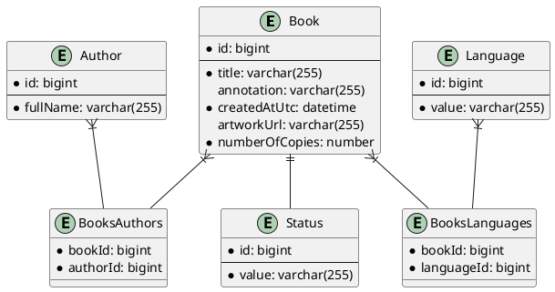

# Books API

## Database scheme 

<!--

```plantuml
@startuml
entity Book{
  * id: bigint
  --
  * title: varchar(255)
  annotation: varchar(255)
  * createdAtUtc: datetime
  artworkUrl: varchar(255)
  * numberOfCopies: number
}
entity Status{
  * id: bigint
  --
  * value: varchar(255)
}
entity Author{
  * id: bigint
  --
  * fullName: varchar(255)
}
entity Language{
  * id: bigint
  --
  * value: varchar(255)
}
entity BooksAuthors{
  * bookId: bigint
  * authorId: bigint
}
entity BooksLanguages{
  * bookId: bigint
  * languageId: bigint
}
Book ||-- Status
Book }|-- BooksAuthors
Author }|-- BooksAuthors
Book }|-- BooksLanguages
Language }|-- BooksLanguages
@enduml
```
-->