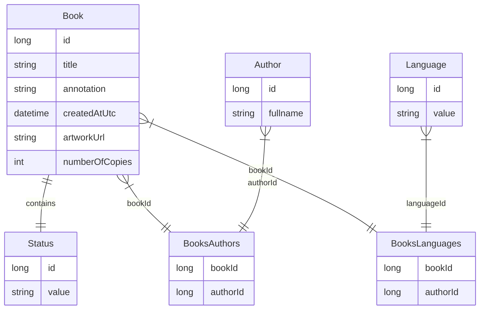

# Books API

## Database scheme 

```mermaid
erDiagram
Book{
  long id
  string title
  string annotation
  datetime createdAtUtc
  string artworkUrl
  int numberOfCopies
}
Status{
  long id
  string value
}
Author{
  long id
  string fullname
}
Language{
  long id
  string value
}
BooksAuthors{
    long bookId
    long authorId
}
BooksLanguages{
    long bookId
    long authorId
}
Book ||--|| Status: contains
Book }|--|| BooksAuthors: bookId
Author }|--|| BooksAuthors: authorId
Book }|--|| BooksLanguages: bookId 
Language }|--|| BooksLanguages: languageId
```