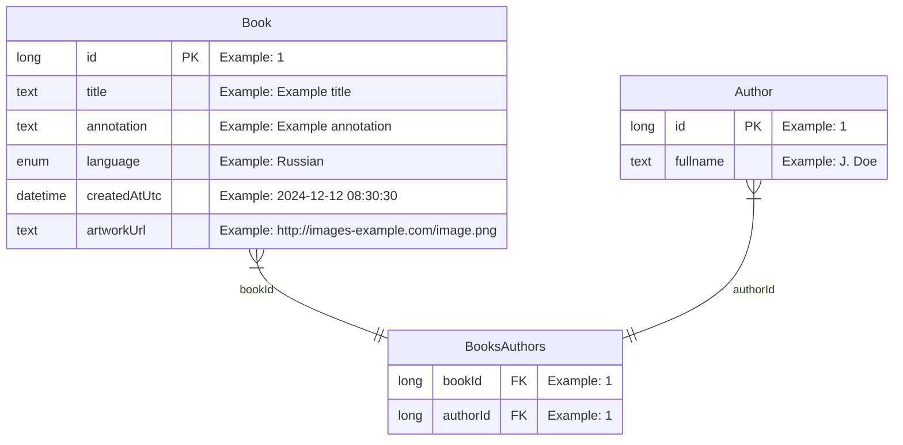

# Books API

## Database scheme 

```mermaid
erDiagram
Book{
  long id PK "Example: 1"
  text title "Example: Example title" 
  text annotation "Example: Example annotation"
  enum language "Example: Russian"
  datetime createdAtUtc "Example: 2024-12-12 08:30:30"
  text artworkUrl "Example: http://images-example.com/image.png"
}
Author{
  long id PK "Example: 1"
  text fullname "Example: J. Doe"
}
BooksAuthors{
    long bookId FK "Example: 1"
    long authorId FK "Example: 1"
}
Book }|--|| BooksAuthors: bookId
Author }|--|| BooksAuthors: authorId
```