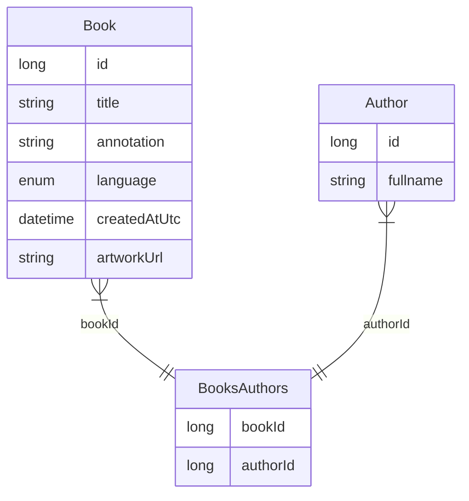

# Books API

## Database scheme 

```mermaid
erDiagram
Book{
  long id
  string title
  string annotation
  enum language
  datetime createdAtUtc
  string artworkUrl
}
Author{
  long id
  string fullname
}
BooksAuthors{
    long bookId
    long authorId
}
Book }|--|| BooksAuthors: bookId
Author }|--|| BooksAuthors: authorId
```