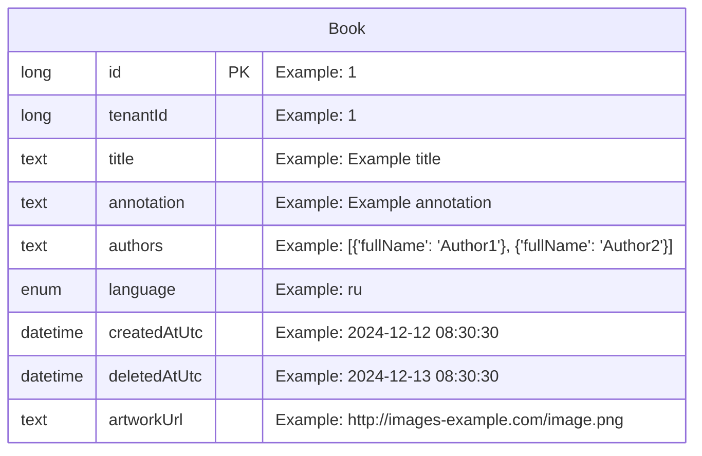

# Books API

## Database scheme 

```mermaid
erDiagram
Book{
  long id PK "Example: 1"
  long tenantId "Example: 1"
  text title "Example: Example title" 
  text annotation "Example: Example annotation"
  text authors "Example: [{'fullName': 'Author1'}, {'fullName': 'Author2'}]"
  enum language "Example: ru"
  datetime createdAtUtc "Example: 2024-12-12 08:30:30"
  datetime deletedAtUtc "Example: 2024-12-13 08:30:30"
  text artworkUrl "Example: http://images-example.com/image.png"
}
```