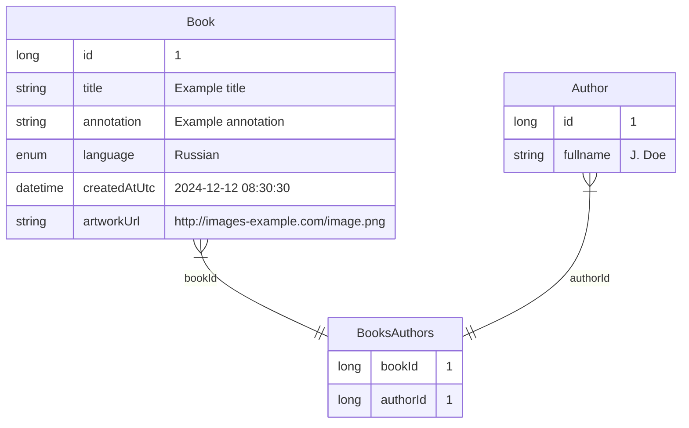

# Books API

## Database scheme 

```mermaid
erDiagram
Book{
  long id "1"
  string title "Example title" 
  string annotation "Example annotation"
  enum language "Russian"
  datetime createdAtUtc "2024-12-12 08:30:30"
  string artworkUrl "http://images-example.com/image.png"
}
Author{
  long id "1"
  string fullname "J. Doe"
}
BooksAuthors{
    long bookId "1"
    long authorId "1"
}
Book }|--|| BooksAuthors: bookId
Author }|--|| BooksAuthors: authorId
```