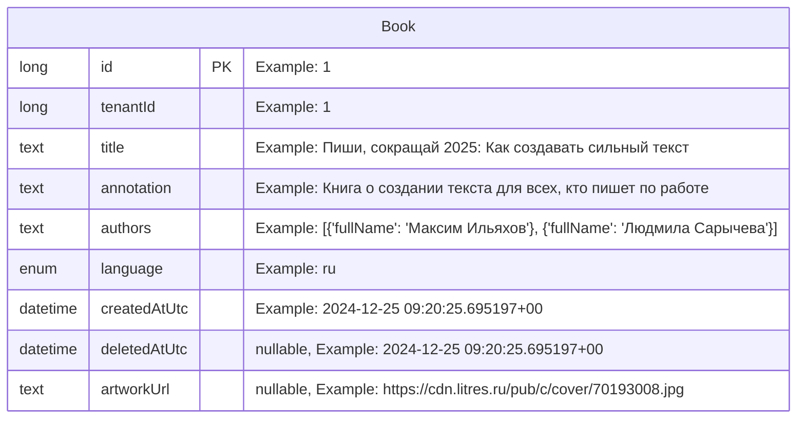

# Books API

## Database scheme 

```mermaid
erDiagram
Book{
  long id PK "Example: 1"
  long tenantId "Example: 1"
  text title "Example: Пиши, сокращай 2025: Как создавать сильный текст" 
  text annotation "Example: Книга о создании текста для всех, кто пишет по работе"
  text authors "Example: [{'fullName': 'Максим Ильяхов'}, {'fullName': 'Людмила Сарычева'}]"
  enum language "Example: ru"
  datetime createdAtUtc "Example: 2024-12-25 09:20:25.695197+00"
  datetime deletedAtUtc "nullable, Example: 2024-12-25 09:20:25.695197+00"
  text artworkUrl "nullable, Example: https://cdn.litres.ru/pub/c/cover/70193008.jpg"
}
```