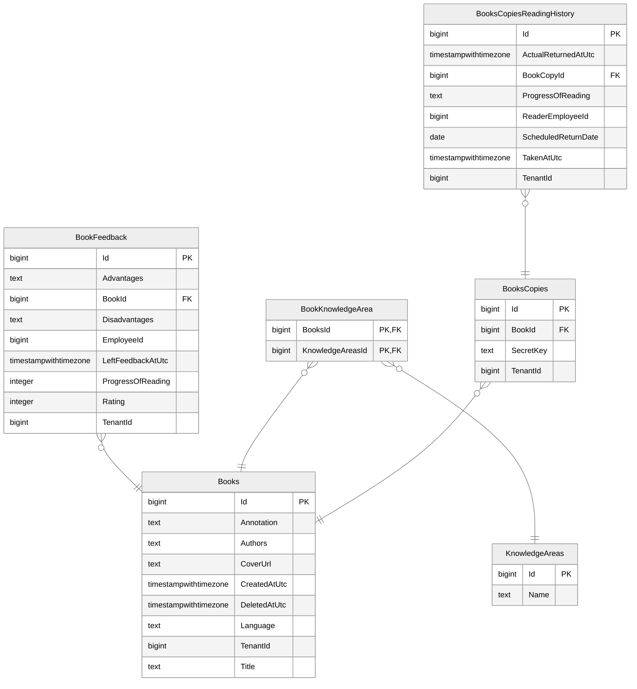

# inner-circle-books-api

This repo contains Inner Circle Books API.

This repo and its infrastructure tailored for VSCode/GitHub Codespaces Dev Container centric development experience in Docker to achieve better isolation of the environment as well as its cross-platform support out of the box.
For instance, Visual Studio for Mac support stops at .NET 8, thus, we needed something else rather than native Visual Studios for Mac and Windows. We decided to give a shot to VSCode since we already use it intensively in other stacks.

Full info about Inner Circle .NET related code conventions, patterns, decisions, and reasoning can be found [here](https://github.com/TourmalineCore/inner-circle-documentation/blob/master/code-style/api-code-style.md).

More info about the Inner Circle project and its related repos can be found here: [inner-circle-documentation](https://github.com/TourmalineCore/inner-circle-documentation).

## Prerequisites

1. Install Docker Desktop (Windows, macOS) or Docker Engine (Linux)
>Note: It seems like there is Docker Engine for Linux (https://docs.docker.com/desktop/setup/install/linux/ubuntu/).
2. **Windows Only** [Install WSL](https://learn.microsoft.com/en-us/windows/wsl/install) and **clone** this repo only to the WSL file system. [This](https://github.com/microsoft/vscode-dotnettools/issues/2714#issuecomment-3818812500) GitHub issue explains what would happen otherwise. Your Solution Explorer won't work as expected.
3. Install Visual Studio Code.
4. Install all repo's recommended extensions including [Dev Containers](https://marketplace.visualstudio.com/items?itemName=ms-vscode-remote.remote-containers).

>Note: this repo hardcodes `container_name` for its Docker Compose services, and container names are global in Docker, not scoped per Compose project. If another stack (e.g. `inner-circle-books-ui/local-run`) already runs containers named `inner-circle-books-api*`, the Dev Container will fail to start with `Conflict. The container name ... is already in use`. Stop that stack first.

## Develop inside Dev Container

Open this repo's folder in VSCode/Codespaces, it might immediately propose you to re-open it in a Dev Container or you can click on `Remote Explorer`, find plus button and choose the `Open Current Folder in Container` option and wait when it is ready.

When your Dev Container is ready, the VSCode window will be re-opened. Open a new terminal in this Dev Container which will be executing the commands under this prepared Linux container where we already have all pre-installed and pre-configured development related dependencies.

Db, MockServer, and PgAdmin are started automatically together with the Dev Container, see `runServices` in [devcontainer.json](.devcontainer/devcontainer.json).

### Run API

```cli
dotnet run --project ./Api --verbosity detailed
```

### Run Unit and Integrational Tests

To run xUnit unit and integrational tests execute the following script in Terminal:
```cli
dotnet test --verbosity detailed
```

### Run E2E Tests

To run Karate E2E tests execute the following script in Terminal:
```cli
java -jar /karate.jar .
```

### Migrations

Full docs and useful snippets about migrations in this infrastructre setup are available [here](https://github.com/TourmalineCore/inner-circle-documentation/blob/master/code-style/api-code-style.md#migrations).

#### Add Migration

To add a new migration with the domain changes execute the following script in Terminal:
```cli
dotnet ef migrations add <YOUR_NEW_MIGRATION_NAME> --startup-project ./Api/Api.csproj --project ./Application/Application.csproj --context AppDbContext --verbose
```

#### Update Database

To apply pending migrations execute the following script in Terminal:
```cli
dotnet ef database update --startup-project ./Api/Api.csproj --project ./Application/Application.csproj --context AppDbContext --verbose
```

### Allocated Ports & Services

| Service Name                   | Api in Dev Container/Codespaces | Api in IDE | Api in Docker Compose |  Db in Docker Compose | MockServer in Docker Compose | PgAdmin in Docker Compose |
| :----------------------------  | :-----------------------------: | :--------: | :-------------------: | :-------------------: | :-------------------------: | :-------------------------: |
| inner-circle-books-api         |               4505              |    5505    |          6505         |          7505         |             8505            |             9505            |

Full docs about the allocated ports, reasoning, and the other services bindings in this infrastructre setup are available [here](https://github.com/TourmalineCore/inner-circle-documentation/blob/master/code-style/ports.md).

You can go to `Ports` tab in the `Terminal` parent panel to find available services.

The most useful is `PgAdmin` http://localhost:9505 (password is `postgres`).

## Swagger

Swagger UI is accessible at http://localhost:4505/swagger/index.html and the OpenApi contract at http://localhost:4505/swagger/v1/swagger.json.

## Database Schema


